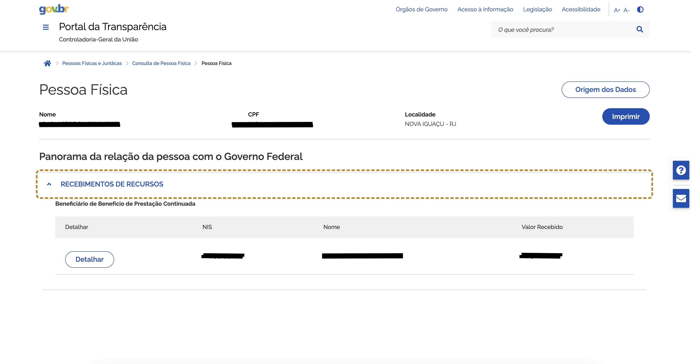

# Bot Portal da Transparência

Este bot visa coletar informação do portal da transparência tendo como dado inicial o nome, CPF ou NIS da pessoa. O mesmo vai coletar as informações e salvar em um JSON no diretório `data` com o seguinte padrão `valor_informado_recebimento_recursos_data_hora_consulta.json` além de fazer um screenshot da tela e salvar no mesmo padrão em formato PNG.



# Estrutura Sugerida do Projeto

## Bot via terminal

```bash
mostqi-python/
│
├── bot/
│   ├── __init__.py
│   ├── main.py             # ponto de entrada
│   ├── scraper.py          # lógica de scraping com playwright
│   └──  parser.py           # limpeza e transformação dos dados
│
├── data/
│   └── output.json         # saída dos dados
│
├── requirements.txt
└── README.md
```

## Instalação

### Docker (recomendado)

Para utilizar é necessário que você tenha o Docker instalado e configurado, tendo isso basta seguir o passo a passo abaixo:

- Criando o build do container:

```bash
docker build -t auto_bot .
```

- Iniciando o container:

```bash
docker run -it -v $(pwd):/app auto_bot
```

### Sem o Docker (Linux/Mac)

1. Crie o `venv`:

```bash
python -m venv venv
```

2. Ativar o `venv`:

```bash
source venv/bin/activate
```

3. Instalar as bibliotecas:

```bash
pip install --upgrade pip
pip install -r requirements.txt
```

4. Rodando o bot:

```bash
python bot/main.py
```

> Se prefirir use o script de instalação:

```bash
chmod +x run_bot.sh
```

e então:

```bash
./script.sh
```

### Sem Docker (Windows)


1. Crie o `venv`:

```bash
python -m venv venv
```

2. Ativar o `venv`:

```bash
venv\Scripts\activate
```

3. Instalar as bibliotecas:

```bash
pip install --upgrade pip
pip install -r requirements.txt
```

4. Rodando o bot:

```bash
python bot\main.py
```


## Como utilizar

Após executar o build do container, no terminal vai aparecer uma solicitação para você adicionar o nome, NIS ou CPF desejado. Feito isso a automação será iniciado e dentro do diretório data você vai encontrar as informações que foram geradas, sendo elas:

- Screenshot da tela de beneficio;
- JSON com os dados requisitados.

# Desafios enfrentados

1 - O xPath do Termo estava excedendo o timeout por não estar visível devido a um erro de permissao 403.
> A solução foi adicionar `user_agent`.

2 - Problemas com o checkbox.
> Foi solucionado forçando a marcação do item com javascript.

3 - Devido ao site identificar que era uma automação o mesmo começou a apresentar uma verificação via captcha.

> Solucao criar uma funcao que resolve o mesmo utilizando uma API de terceiro no entando como é paga deixei desabilitada.

